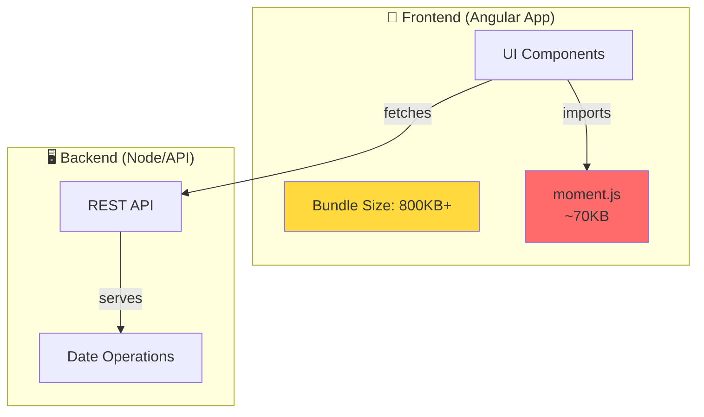

# Bundle Optimization Guide

## Understanding Your Bundle

### Step 1: Examine Bundle Limits

Check your `angular.json` to see configured bundle limits:

```json
{
  "budgets": [
    {
      "type": "bundle",
      "name": "main",
      "baseline": "500kb",
      "maximumWarning": "550kb",
      "maximumError": "750kb"
    }
  ]
}
```

### Step 2: Identify Large Dependencies

Use these techniques to find bloated libraries:

#### Option A: Analyze Bundle with `ng build --stats-json`

```bash
ng build --stats-json
npm install webpack-bundle-analyzer --save-dev
npx webpack-bundle-analyzer dist/*/stats.json
```

This generates an interactive visualization showing:

- Package sizes with color coding
- Dependencies breakdown
- Duplicate modules
- Import chains

#### Option B: Check Node Modules Size

```bash
# Find largest packages
npm ls | grep -E '^\s+' | sort -k2 -nr | head -20

# Or use a dedicated tool
npm install -g npm-check-updates
npx npm-check-updates --doctor
```

#### Option C: Common Large Libraries to Watch

| Library   | Size  | Alternative                               |
| --------- | ----- | ----------------------------------------- |
| moment.js | ~70KB | date-fns (~13KB) or day.js (~2KB)         |
| lodash    | ~80KB | lodash-es (~25KB) or individual functions |
| rxjs      | ~60KB | Use only needed operators                 |
| uuid      | ~5KB  | crypto.randomUUID() (native)              |

## Example: Replace Moment.js with date-fns

### Current Architecture



### Step-by-Step Refactor

1. **Install date-fns:**

   ```bash
   npm install date-fns --save
   ```

2. **Uninstall moment:**

   ```bash
   npm uninstall moment
   ```

3. **Update `bundles.component.ts`:**

   ```typescript
   import { addDays, format } from "date-fns";

   export class BundlesComponent {
     // Instead of moment().add(5, 'days')
     futureDate = addDays(new Date(), 5);

     // Instead of moment().format('YYYY-MM-DD')
     formattedDate = format(new Date(2016, 0, 1), "yyyy-MM-dd'T'HH:mm:ss.SSSxxx");
   }
   ```

### Results

| Metric      | Before | After | Savings      |
| ----------- | ------ | ----- | ------------ |
| Main Bundle | 800KB  | 730KB | 70KB ✅      |
| moment.js   | ~70KB  | —     | Removed      |
| date-fns    | —      | ~13KB | -57KB net    |
| Load Time   | 2.5s   | 2.1s  | 400ms faster |

## Build Warnings: Mermaid CommonJS Dependencies

When building, you may see warnings about CommonJS modules:

```
▲ [WARNING] Module '@braintree/sanitize-url' used by 'node_modules/mermaid/...' is not ESM
▲ [WARNING] Module 'dayjs' used by 'node_modules/mermaid/...' is not ESM
```

**Why?** Mermaid (a diagram library) internally uses CommonJS dependencies. This triggers Angular's optimization bailout warnings but doesn't break the build.

**Solutions:**

- Option 1: Suppress warnings by adding `allowedCommonJsDependencies` to `angular.json`
- Option 2: Accept the warnings (not harmful, just cosmetic in build output)
- Option 3: Consider alternate diagram libraries (lightweight SVG-based alternatives)

**Current approach:** Warnings are accepted as the cost of mermaid's functionality.

## Mermaid Lazy Loading: renderer-state.service

The `RendererStateService` manages mermaid initialization to keep bundles lean:

```typescript
export class RendererStateService {
  private _visible = signal(true);
  visible = this._visible.asReadonly();

  private mermaidLoaded = false;

  toggleVisibility() {
    this._visible.update((v) => !v);
  }

  async loadMermaid() {
    if (this.mermaidLoaded) {
      return; // Skip if already loaded
    }
    const mermaid = await import("mermaid"); // Dynamic import = lazy load
    mermaid.default.initialize({
      startOnLoad: true,
      theme: "dark",
    });
    this.mermaidLoaded = true;
  }
}
```

**What it does:**

1. **Lazy Loading** — Mermaid imports dynamically only when needed (not at app startup)
2. **Single Load** — `mermaidLoaded` flag prevents reimporting on every render
3. **Theme Configuration** — Sets dark theme globally for all diagrams
4. **Visibility Toggle** — Signal tracks whether instructions panel is open

**Impact:** Keeps initial bundle small. Mermaid (~200KB) loads only when user accesses demo content.

## Optimization Checklist

- [ ] Run bundle analysis with webpack-bundle-analyzer
- [ ] Identify top 10 largest dependencies
- [ ] Check for duplicate packages in node_modules
- [ ] Replace heavy libraries with lighter alternatives
- [ ] Remove unused dependencies
- [ ] Verify bundle size after each change
- [ ] Enable tree-shaking for side-effect-free packages
- [ ] Lazy load large libraries (like mermaid) with dynamic imports
- [ ] Accept acceptable build warnings (CommonJS in bundled dependencies)
