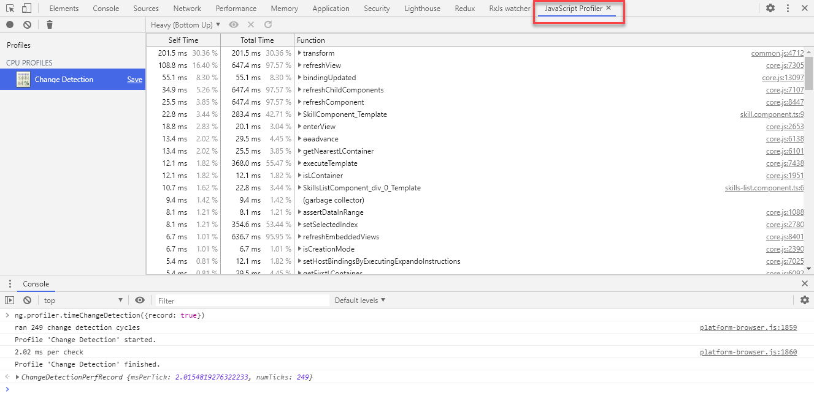

# Optimizing Angular

## Demo Index

| #   | Route              | Title                      | Teaches                                                                                                                    | Topic                    |
| --- | ------------------ | -------------------------- | -------------------------------------------------------------------------------------------------------------------------- | ------------------------ |
| 1   | lighthouse         | Instrument Web Vitals      | Measure and optimize Core Web Vitals and performance metrics using Chrome DevTools Lighthouse audits.                      | Performance Measurement  |
| 2   | optimize-bundles   | Optimize Bundles & Loading | Analyze and reduce bundle size for faster loading by understanding esbuild and tree-shaking mechanisms.                    | Bundle Optimization      |
| 3   | configure-zoneless | Configure Zoneless         | Enable zoneless change detection using provideZonelessChangeDetection() for reduced overhead and signal-driven reactivity. | Performance Optimization |
| 6   | virtual-scroll     | Virtual Scroll             | Render large lists efficiently with CDK virtual scrolling by dynamically loading and unloading visible items.              | Performance Optimization |
| 7   | ng-optimized-img   | NgOptimizedImage           | Use NgOptimizedImage directive for responsive image optimization with automatic srcset generation.                         | Asset Optimization       |
| 8   | a11y               | A11y Optimization          | Implement WCAG AA accessibility standards using semantic HTML, ARIA attributes, and accessibility linting.                 | Accessibility            |
| 9   | eslint             | Implement Linting          | Configure and enforce code quality rules with ESLint to maintain consistent coding standards.                              | Code Quality             |

---

[Lighthouse](https://developers.google.com/web/tools/lighthouse)

[Core Web Vitals](https://web.dev/explore/learn-core-web-vitals)

[Angular AOT Compiler](https://angular.io/guide/aot-compiler)

[Angular Debug Statements](https://angular.io/api/core/global)

[Airbnb Style Guide](https://github.com/webdev-tools/tslint-airbnb-styleguide)

## Accessibility

[Accessible Rich Internet Applications - ARIA](https://developer.mozilla.org/en-US/docs/Web/Accessibility/ARIA)

[Angular A11y Guide](https://angular.io/guide/accessibility)

[Material A11y](https://material.angular.io/cdk/a11y/overview)

[Lab: Angular A11y](https://codelabs.developers.google.com/angular-a11y)

## Change Detection

Parts of the slides are taken from:

[The Last Guide For Angular Change Detection You'll Ever Need - (c) Michael Hoffmann](https://www.mokkapps.de/blog/the-last-guide-for-angular-change-detection-you-will-ever-need/#:~:text=By%20default%2C%20Angular%20Change%20Detection,which%20produces%20VM%2Doptimized%20code.)

Enable Angular Debug Tools in `main.ts`:

```typescript
platformBrowserDynamic()
  .bootstrapModule(AppModule)
  .then(moduleRef => {
    const applicationRef = moduleRef.injector.get(ApplicationRef);
    const componentRef = applicationRef.components[0];
    // allows to run `ng.profiler.timeChangeDetection();`
    enableDebugTools(componentRef);
  })
  .catch(err => console.error(err));
```

Run App, select sample 'Change Detection' open console and enter:

```
ng.profiler.timeChangeDetection()
```

Change ChangeDetectionStrategy in `skills-list.component.ts` and compare values

Using `Running ng.profiler.timeChangeDetection({record: true})` allows you to see a detailed execution report using JavaScriptProfiler


