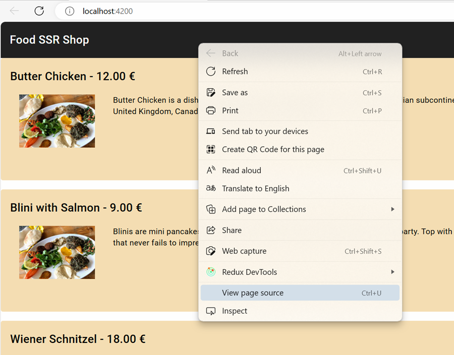

# Server Side Rendering (SSR)

- Create a new Angular project. Starting with Angular 21 SSR is enabled by default. To disable it use `--ssr=false`. So you could basically skip the `--ssr=true` option. To add it to an existing project use `ng add @angular/ssr`:

  ```
  ng new food-shop-ssr --routing --style=scss --ssr=true
  cd food-shop-ssr
  ```

- Examine `package.json` and note the `@angular/ssr`and `express` dependencies. Also note the `serve:ssr:food-shop-ssr` script. It starts the Node Express server and runs the Angular app in SSR mode.

- Examine the registration of [ClientHydration](https://angular.io/guide/hydration) in `app.config.ts`. This enables seamless hydration where the server renders the initial HTML and the client takes over without re-rendering:

  ```typescript
  export const appConfig: ApplicationConfig = {
    providers: [
      provideHttpClient(withFetch()),
      provideRouter(foodRoutes),
      provideClientHydration(),
      provideAnimations()
    ]
  };
  ```

- Add Angular Material:

  ```
  ng add @angular/material
  ```

- Add the following html to app.component.html and also add the required imports:

  ```html
  <mat-toolbar>
      <mat-toolbar-row>
          Food SSR Shop
      </mat-toolbar-row>
  </mat-toolbar>
  <router-outlet></router-outlet>
  ```

- Add a script to track First Contentful Paint (FCP) to the `<head>` of `index.html`:

  ```javascript
  <script>
      // Log first contentful paint
      // https://web.dev/fcp/#measure-fcp-in-javascript
      const observer = new PerformanceObserver((list) => {
      for (const entry of list.getEntriesByName("first-contentful-paint")) {
          console.log("FCP: ", entry.startTime);
          observer.disconnect();
      }
      });
      observer.observe({ type: "paint", buffered: true });
  </script>
  ```

  > Note: Reade more about [PerformanceObserver](https://developer.mozilla.org/en-US/docs/Web/API/PerformanceObserver) on MDN and on [web.dev](https://web.dev/articles/user-centric-performance-metrics).

- Execute Client and note the `First Contentful Paint (FCP)` value in the console:

  ```bash
  ng s -o
  ```

- Examine the page source and note that content is rendered by the browser using JavaScript (no server-side content initially):

  

- Execute Node Express on `http://localhost:4000` and compare:
  - First Contentful Paint (FCP) values (should be faster with SSR)
  - HTML source (should contain fully rendered markup)
  - Lighthouse Audit scripting time (should be lower with pre-rendering)

  ```bash
  ng build
  npm run serve:ssr:food-shop-ssr
  ```

  > Compare the client-side vs SSR performance metrics. With pre-rendering, FCP is significantly improved because HTML is already generated at build time.

## Modern Component Patterns (Angular v21+)

The food-shop-ssr app demonstrates modern Angular component patterns. Review these key components to understand signal-based architecture:

- **FoodListComponent** uses `httpResource()` for reactive data loading and `signal()` for cart state management with `ChangeDetectionStrategy.OnPush`
- **ShopItemComponent** uses `input()` and `output()` signals instead of decorators, with `effect()` for synchronizing input changes
- **NumberPickerComponent** is a pure signal-based component (no ControlValueAccessor), using `input()`, `output()`, and `signal()` for all state
- **FoodDetailsComponent** uses `toSignal()` to convert route params to signals and `httpResource()` for dynamic data loading based on route ID
- **FoodItem** and **FoodCartItem** are TypeScript interfaces for type safety

  > Note: Review each component in `src/app/food/` and `src/app/shared/` to understand how standalone components use signals for state and lifecycle management.

- Add routes to `app.routes.ts`:

  ```typescript
  export const foodRoutes: Routes = [
    {
      path: '',
      component: FoodListComponent,
    },
    {
      path: 'food/:id',
      component: FoodDetailsComponent,
    }
  ];
  ```

## Pre-rendering Static Routes

Pre-rendering generates static HTML files at build time, improving performance and enabling offline access.

- Create `routes.txt` in the root folder. It defines routes to pre-render:

  ```
  /food/1
  /food/2
  /food/3
  ```

- To configure pre-rendered pages, open `angular.json` and update the `architect` → `build` → `options` section:

  ```json
  "prerender": {
    "routesFile": "routes.txt"
  },
  ```

- Execute pre-rendering during production build:

  ```bash
  ng build -c production
  ```

- Examine the pre-rendered HTML files in `dist/food-shop-ssr/browser/food/1/index.html`, etc. These are static HTML files generated at build time.

## Key Takeaways

### SSR Benefits

- Improved First Contentful Paint (FCP) - content visible immediately
- Better SEO - search engines see fully rendered HTML
- Reduced time to interactive - server handles initial payload
- Progressive enhancement - works even with JavaScript errors

### Best Practices for SSR Components (Angular v21+)

1. **Use `ChangeDetectionStrategy.OnPush`** for all components to reduce change detection overhead
2. **Leverage signals** (`input()`, `output()`, `signal()`) for reactive state management
3. **Use `httpResource()`** for data loading - handles loading states and errors automatically
4. **Avoid browser APIs in components** (use `isPlatformBrowser()` if needed)
5. **Pre-render static routes** for maximum performance gains
6. **Test hydration** - ensure server-rendered HTML matches client-side output

### Implementation Patterns in food-shop-ssr

The food-shop-ssr demo demonstrates:

- Standalone components with signal-based inputs/outputs
- Pure signal-based state management (no `ControlValueAccessor`)
- Dynamic route params converted to signals with `toSignal()`
- Reactive data loading with `httpResource()`
- Client hydration for seamless server-to-client transition

## Related Topics

- [Angular Signals Documentation](https://angular.dev/guide/signals)
- [Angular SSR Guide](https://angular.dev/guide/ssr)
- [Client Hydration](https://angular.dev/guide/hydration)
- [ngOptimizedImage for core web vitals](https://angular.dev/guide/image-optimization#)
- [Web Vitals and Performance Monitoring](https://web.dev/articles/user-centric-performance-metrics)
