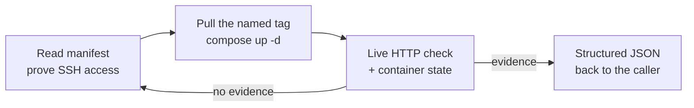

# The Deployment Agent

A deployment agent is a sub-agent whose entire job is to move a build onto a host and prove it landed. This topic is about the agent itself: its frontmatter, the shell verbs it is allowed to speak, the manifest it reads instead of remembering, the loop that turns "deployed" into evidence, and the JSON it hands back to whoever called it. The target here is a plain Ubuntu host reached over SSH, so nothing on this page depends on a provider API.

## Why Deployment Gets Its Own Agent

Deployment work has a different risk profile from application work, and mixing them in one context window costs you on both sides. A deploy run fills its window with SSH transcripts, container listings and log tails, which is exactly the noise you do not want in a session that is reasoning about your code. In the other direction, an agent that can edit application files and also restart production containers has no boundary between a refactor and an outage.

Running deployment in an isolated sub-agent gives you three things at once: a clean parent context, a permission set scoped to deployment verbs only, and a definition you can review in a pull request like any other file. The agent is a text file, so "what is this thing allowed to do on our host" is a diff, not a conversation.

## The Agent File

A sub-agent is a Markdown file with YAML frontmatter. The frontmatter pins the model, names the tools and attaches MCP servers; the body is the system prompt. This is the SSH-target agent you build in this topic's demo.

```yaml
---
name: ssh-deploy-agent
description: >-
  Deployment specialist for a containerized app on an Ubuntu host reached over SSH.
  Owns access checks, image rollout, Compose bring-up, and live verification.
  Apply when the task is "deploy to the box", "bring up the stack",
  "roll out a new image tag", or "the site is down after a deploy".
model: sonnet
tools: [Read, Write, Edit, Bash, Glob, Grep, WebFetch,
        mcp__chrome-devtools__navigate_page, mcp__chrome-devtools__take_screenshot,
        mcp__github__*]
mcpServers:
  chrome-devtools: { type: stdio, command: npx, args: ["-y", "chrome-devtools-mcp@latest"] }
  github: { type: http, url: https://api.githubcopilot.com/mcp/ }
---
```

Two MCP servers are enough for this target. `chrome-devtools` opens the deployed URL and captures the screenshot that ends the run, and `github` reads workflow runs and logs when the image was built in CI. There is no cloud-control-plane MCP here, because on this target there is no control plane: the host is reached with `ssh` and the app is `docker compose`.

## The Shell Allowlist

Agent frontmatter names tools, not verbs: there is no `permissions` field in a sub-agent file, so command-level scoping lives in `.claude/settings.json` beside the agent and applies to every session in the project. `tools` decides which tools exist for this agent; these rules decide which shell commands run without stopping to ask.

```json
{
  "permissions": {
    "allow": ["Bash(ssh:*)", "Bash(scp:*)", "Bash(docker:*)", "Bash(gh:*)", "Bash(git:*)", "Bash(ls:*)"],
    "deny": ["Bash(rm:*)", "Bash(npm:*)", "Bash(node:*)", "Bash(dotnet:*)"]
  }
}
```

The allowlist is the real security boundary, and it is deliberately six verbs wide. `ssh` and `scp` reach the host, `docker` drives containers locally and remotely, `gh` reads the pipeline that built the image, `git` confirms what is committed, and `ls` reads the local tree. Anything a deployment does not need is simply absent from the list.

| Verb | Why the agent needs it |
|---|---|
| `ssh` | Every action on the host, from the first access check to the rollout commands |
| `scp` | Push a Compose file, a Caddyfile, or an env file to an exact path on the host |
| `docker` | Build and run the local target container, inspect images, drive `docker compose` |
| `gh` | Read the workflow run that produced the image tag and pull logs when it failed |
| `git` | Confirm the deploy config is committed on the branch the pipeline builds from |
| `ls` | Read the local project layout without a general-purpose shell |

The deny list matters as much as the allow list. `npm`, `node` and `dotnet` are denied so the agent cannot drift into a local build: images are produced by CI and the host only pulls them, so an agent that can build is an agent that can ship an artifact nobody else can reproduce. `rm` is denied outright, because the single most expensive mistake on a shared host is a confident cleanup of somebody else's volume.

Denying a tool is not the same as denying a capability. `Bash(ssh:*)` still lets the agent run any command on the far side of the connection, so the guardrail that actually holds on the host is the deploy user's own privileges, not the rule list. Scope the remote account, do not assume the local permission rules travel over the wire.

## The Manifest Is the Source of Truth

The agent reads a deployment manifest before every operation and sources every value from it. Host addresses, SSH users, ports and image tags are exactly the facts a model will happily reconstruct from a conversation three days old, and a reconstructed port number is a deploy against the wrong service. The manifest is committed, reviewable and diffable, which makes a deploy reproducible by a person as well as by an agent.

```json
{
  "host": "127.0.0.1",
  "sshPort": 2222,
  "user": "deploy",
  "keyFile": "~/.ssh/box_ed25519",
  "stackPath": "/opt/box-stack",
  "services": {
    "web": { "image": "ghcr.io/<org>/web:latest", "internalPort": 8080 },
    "edge": { "image": "caddy:2-alpine", "publishedPorts": [80, 443] }
  },
  "verifyUrls": ["http://127.0.0.1:8080/healthz"]
}
```

The rule the agent follows is short: if a value is not in the manifest, ask for it and write it there, never infer it. A missing image tag is the failure that hurts most, because `docker compose pull` on a stale tag exits 0, `up -d` sees no change, and the run reports success over an unchanged site. The manifest is what makes that mismatch a diff you can read instead of a silence you have to debug.

## The Deploy-Then-Prove Loop

Every run is three phases, and the agent is not allowed to report success from the middle one. Pre-deploy, it reads the manifest and proves access before touching anything, because building images and editing config against a host you cannot log into is the most common way to waste an hour. Deploy is a pull and a recreate against the tag the manifest names. Post-deploy, it produces evidence.



Proof is two independent checks, and neither one alone is enough. A live HTTP check says the edge answers; a container state check says the thing answering is the build you just shipped and that nothing else on the host moved. A container can be `running` and healthy while serving the previous image, and a URL can return 200 from a cached edge while the app behind it is down.

| Claim | What the agent must show |
|---|---|
| The site answers | `curl -s -o /dev/null -w '%{http_code}' <url>` returning `200` for every entry in `verifyUrls` |
| The new build is live | `docker inspect <container> --format "{{.Image}} {{.Config.Image}}"` matching the manifest tag, plus the image creation timestamp |
| The stack is healthy | `docker compose ps` with every service `running`, and no service listed by `docker ps --filter health=unhealthy` |
| Nothing else moved | The container count on the host before and after the run, unchanged |

A green pipeline is not one of these. CI success only proves the SSH commands exited 0, which they also do when the rollout was a no-op. The final screenshot through the `chrome-devtools` MCP is the human-readable half of the same evidence, and it belongs in the response, not in the transcript.

## Stop and Ask

The agent has one rule that overrides every other instruction: stop and ask when the state is destructive or ambiguous. Names on a host mean something to the team (DNS records, monitoring targets, firewall entries, other people's containers), so renaming, suffixing or "just recreating" without approval breaks things the agent cannot see.

| Situation | Why the agent must not decide alone |
|---|---|
| A container name or host port is already taken | On a shared box the other claimant is somebody else's live service |
| A container is already unhealthy before the deploy | Rolling forward over an existing failure destroys the evidence of its cause |
| The key authenticates as a different user than the manifest names | Either the manifest is wrong or the host is; both are the user's call |
| SSH hardening would be applied with no verified second session | The next `sshd` restart locks everyone out, and only rescue mode gets you back |
| A hostname does not resolve to this host yet | Starting the edge early burns the certificate authority's failed-validation budget |
| Cleanup would remove a volume, an image, or a credential file | These are the operations with no undo on a live host |

Stopping is cheap and reversing a deploy is not, which is the whole justification. An agent that asks once per run is still an enormous speedup; an agent that guesses once per run is a liability.

## The Structured Response Contract

When an orchestrator spawns this agent, it asks for a structured response, and the agent returns a single JSON object with no prose and no Markdown fences. That is what lets the caller validate the result against a schema and branch on it, rather than parsing English.

```json
{
  "status": "success",
  "target": "<user>@<host>:<port>",
  "imageTags": ["ghcr.io/<org>/web:<sha>"],
  "filesChanged": ["<relative-path>"],
  "verifiedUrls": [{ "url": "<url>", "httpStatus": 200 }],
  "containerState": [{ "service": "web", "state": "running", "health": "healthy" }],
  "summary": "<one sentence describing what was deployed>",
  "errors": []
}
```

`status` takes `success`, `failure` or `partial`, so an orchestrator can sequence a follow-up job on the difference. The `verifiedUrls` and `containerState` fields are the contract's teeth: they carry the two proofs from the loop above, so a caller can reject a `success` that arrives with an empty verification array.

## Two Targets, One Pattern

The agent on this page talks to a host you operate. The other shape a deployment agent takes talks to a provider control plane instead, a managed runtime where you trigger a pipeline and the platform places the artifact. Almost every idea on this page carries over to that shape unchanged: the frontmatter, a pre-deployment phase that reads config and state instead of remembering them, a verification phase the agent may not skip, a stop-and-ask rule for names that are already taken, and a structured JSON response contract.

What changes between the two is where the boundary lives. On a managed target the deploying identity's own role assignments already bound what a wrong command can reach, so the shell allowlist carries less weight. On your own host nothing bounds it for you, which is why the SSH shape leans on its settings rules and the deploy user's privileges as the entire boundary.

| | Managed-runtime target (the alternative shape) | SSH target (the agent you build here) |
|---|---|---|
| What the agent talks to | A provider control plane and the CI API | A host, over one SSH connection |
| Shell verbs it speaks | The provider CLI plus `gh` and `git`, backed by a cloud MCP server | `ssh`, `scp`, `docker`, `gh`, `git`, `ls` |
| Where the boundary sits | The deploying identity's role assignments | The settings allowlist plus the deploy user's privileges |
| Source of truth | Deployment config plus the provider's own resource state | The committed manifest, because the host has no API to ask |
| What deploy means | Trigger a workflow, the platform places the artifact | Pull a tag and recreate a container, yourself |
| What "verified" means | Run status, then the live URL | Live URL plus container state on the host |
| Blast radius of a mistake | Contained to one managed resource | The whole box, including other tenants on it |

This repository's own harness agent at [`.claude/agents/github-devops-agent.md`](../../../.claude/agents/github-devops-agent.md) is this same SSH pattern, scoped for production rather than a demo, and provider-managed targets are explicitly out of its scope. Open it beside this page as the fuller version of what you write in the demo: the same six-verb allowlist, the same manifest rule, the same deploy-then-prove loop and the same JSON contract, plus three things the demo leaves out. It adds host access and bootstrap (non-root deploy user, key-only SSH, hardening in a safe order), the ordering rule that DNS must resolve and port 80 must answer before anything requests a certificate, and a troubleshooting table for the failures that actually cost time.

Reach for the managed-runtime shape when the platform already owns placement, rollback and TLS, and you want the agent to drive the pipeline rather than the machine. Reach for the SSH shape when you own the host, when the same agent must work on any provider, or when the cost model or data residency rules out a managed runtime. The SSH shape is also the better teacher, because nothing is hidden: every guarantee the platform normally provides is a step the agent has to perform and prove.

## Hands-On Demo

[Build a Deployment Agent and Prove Its Deploy Loop](demo-deploy-with-devops-agent.md) takes about twenty minutes and needs Docker running locally, with no cloud account. You write the agent definition, scope its allowlist, point it at a manifest, and drive it against a throwaway Ubuntu container standing in for the VM, ending with a structured JSON result you can validate.

## Helpful Claude Slash Commands

| Command | Usage |
|---|---|
| `/agents` | Create the deployment sub-agent and print where its definition lives, so you can edit the frontmatter directly |
| `/permissions` | Audit the `allow` and `deny` shell rules before a run, and confirm no build verb slipped back into the list |
| `/mcp` | Confirm `chrome-devtools` and `github` are connected, since the verification phase silently degrades without them |
| `/context` | Check what is left of the window before a long rollout, because SSH transcripts and log tails fill it fast |

## Key Topics covered in this module

- [Claude Code sub-agents](https://code.claude.com/docs/en/sub-agents): frontmatter fields, tool lists, and how an isolated context window is spawned
- [Claude Code settings and permissions](https://code.claude.com/docs/en/settings): the `allow` and `deny` rule syntax used by the shell allowlist
- [Claude Code MCP](https://code.claude.com/docs/en/mcp): attaching MCP servers to a single agent instead of the whole session
- [Docker Compose CLI reference](https://docs.docker.com/reference/cli/docker/compose/): `pull`, `up -d` and `ps`, the three commands the deploy phase uses
- [Compose healthcheck reference](https://docs.docker.com/reference/compose-file/services/#healthcheck): the field that makes the container state check meaningful
- [OpenSSH ssh(1) manual](https://man.openbsd.org/ssh): `IdentitiesOnly` and `BatchMode`, the two options that make an agent's access check trustworthy
