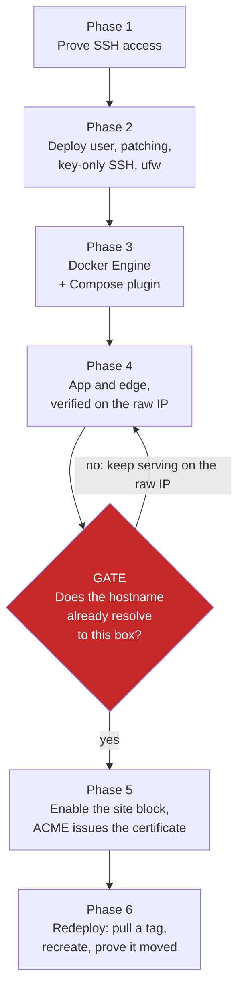

# Deploy a Container Stack to an Ubuntu Host over SSH

This is the module's central topic: taking a containerized app from a registry to a public HTTPS URL on a plain Ubuntu host, using nothing but `ssh`, `apt` and `docker compose`. The work is six ordered phases (access, bootstrap and harden, container runtime, app and edge, DNS and TLS, redeploy), and the order is load bearing rather than stylistic. Two of the transitions lock you out or cost you hours if you take them early, and both of them are on this page.

Nothing here depends on a provider API, so the same phases apply to a VM on Azure, AWS, GCP or Hetzner, and to a container on your laptop standing in for one.

## Why SSH Is the Sharpest Agentic Surface

A managed platform hands an agent a large set of guarantees for free, and hiding them is exactly what makes it a poor teacher. On an SSH host every one of those guarantees becomes a step someone has to perform, and the agent is that someone. There is no `what-if` output to read before committing, no reconciler that will re-converge the host after a partial run, and no previous revision sitting in a control plane waiting to be swapped back.

| Guarantee | Managed platform | Ubuntu host over SSH |
|---|---|---|
| Preview before change | A plan or `what-if` the platform computes for you | None: the first feedback you get is the effect itself |
| Convergence | A reconciler re-applies desired state on a loop | One shot per command, and drift persists until somebody looks |
| Rollback | The previous revision is retained and swappable | Whatever copy you took before you changed it |
| Identity of what is live | A revision id in the control plane | The image digest on the running container, if you ask for it |
| Idempotency | A property of the API you called | A property of the script you wrote |
| Blast radius | Contained to one managed resource | The whole box, other tenants on it included |

That last row is why the discipline matters more here than anywhere else in the course. An agent with `Bash(ssh:*)` can run any command on the far side of the connection, so the boundary that actually holds is the remote account's own privileges plus an ordering that cannot strand you. The common mistake is reading the agent's transcript as evidence: a transcript records what was attempted, and only the host records what is true.

## The Phase Model

The phases run in one direction, and the arrow between Phase 4 and Phase 5 is a gate rather than a step. The edge cannot obtain a certificate for a hostname until that hostname already resolves to the box, so DNS is not a stage in the deploy sequence at all. It is an orthogonal workstream with its own owner and its own latency, and it interlocks with the deployment at exactly this one point.



Each phase ends in a check, not a claim, and the checks are what the agent reports back.

| Phase | What lands | Proof that it landed |
|---|---|---|
| 1: Access | A key login you have actually used | Exit code 0 from a remote `whoami`, and a key fingerprint that matches |
| 2: Bootstrap and harden | `deploy` user, patching, `fail2ban`, key-only SSH, `ufw` | `sshd -T` effective values, `ufw status verbose`, the `20auto-upgrades` keys |
| 3: Container runtime | Docker Engine and the Compose plugin | `docker compose version`, `systemctl is-enabled docker`, `id -nG deploy` |
| 4: App and edge | Compose stack behind one reverse proxy, no app port published | An internal `wget` between containers, and `docker compose ps` showing no host port on app services |
| 5: DNS and TLS | A publicly trusted certificate per hostname | `certificate obtained` in the edge log, and an `openssl s_client` issuer line |
| 6: Redeploy | A new image tag serving traffic | The container's image digest and creation time, plus a byte that only exists in the new build |

### Phase 1: Prove Access Before You Build Anything

The single largest time sink in a deployment is building images, wiring CI and editing identity config before confirming anyone can log in. Prove access first, with the exact key and options the later phases will use.

```bash
ssh -i ~/.ssh/<key> -o IdentitiesOnly=yes -o BatchMode=yes root@<host> 'whoami'
ssh-keygen -l -f ~/.ssh/<key>.pub
```

Three client options carry the weight, and the first is mandatory rather than cosmetic.

| Option | What it does | Why an agent needs it |
|---|---|---|
| `-o IdentitiesOnly=yes` | Offers only the key named by `-i` | Without it `ssh` walks every default key in your agent, the server closes the connection after `MaxAuthTries`, and a perfectly correct key reports `Permission denied` |
| `-o BatchMode=yes` | Disables every interactive prompt | A headless run fails with an exit code instead of hanging on a passphrase or a host-key question |
| `-o StrictHostKeyChecking=accept-new` | Accepts a first-contact host key, still refuses a changed one | Lets CI connect to a new box without pre-seeding `known_hosts`, while keeping the warning that matters |

Match keys by fingerprint, never by filename, because a key file's name routinely names a different registered key. When a correct-looking key is refused, compare the age of the box against the age of the key: a box created before that key was registered never received it, and no amount of retrying changes that. If nothing authenticates, the provider-neutral recovery is a rescue or live environment, mounting the root partition and appending your public key to `/root/.ssh/authorized_keys` with `700` on `.ssh` and `600` on the file. A plain rebuild is not a recovery, because it reuses the original creation-time key.

An MCP server can stand in for these invocations. This repository registers `ssh-mcp` in `.mcp.json`, which holds the connection, carries the sudo password and returns structured results, so the harness agent prefers it over rebuilding an `ssh` command on every call. The sharp edge is that the server is pinned to one host in its own arguments while a deployment manifest names its own, so compare the two before the first command and confirm identity on the connection itself with `hostname` and `hostname -I` rather than trusting either file.

### Phase 2: Bootstrap and Harden in an Order That Cannot Lock You Out

The ordering rule here is the spine of the whole topic. Create the non-root user and verify its key login in a second, already-open session before you disable root and password SSH. An `sshd` restart is instant and unconditional, so a wrong `authorized_keys` mode discovered afterwards is a rescue-mode trip rather than a retry.

```bash
adduser --disabled-password --gecos "" deploy
mkdir -p /home/deploy/.ssh
cp /root/.ssh/authorized_keys /home/deploy/.ssh/authorized_keys
chown -R deploy:deploy /home/deploy/.ssh
chmod 700 /home/deploy/.ssh && chmod 600 /home/deploy/.ssh/authorized_keys
```

The deploy user inherits the key you already proved in Phase 1 rather than getting a new one, which removes a second unverified credential from the sequence. `sshd` silently ignores an `authorized_keys` file that is group-writable or owned by the wrong user, so those two `chmod` values are the difference between a working login and a `Permission denied` that explains nothing.

```bash
apt-get update && apt-get -y upgrade
apt-get -y install ufw fail2ban unattended-upgrades ca-certificates curl gnupg
dpkg-reconfigure -f noninteractive unattended-upgrades
systemctl enable --now fail2ban
```

Only then touch `/etc/ssh/sshd_config`, and validate before restarting.

| Field | Value | What it closes |
|---|---|---|
| `PermitRootLogin` | `no` | Direct root sessions, so every action arrives through an attributable account |
| `PasswordAuthentication` | `no` | The entire brute-force surface, including every leaked password list |
| `PubkeyAuthentication` | `yes` | Stated explicitly, so a distribution default change cannot remove your only way in |

```bash
sshd -t
systemctl restart ssh
sshd -T | grep -E '^(permitrootlogin|passwordauthentication|pubkeyauthentication) '
```

Read the effective config with `sshd -T`, never by grepping the file. Ubuntu's `sshd_config` opens with `Include /etc/ssh/sshd_config.d/*.conf` and `sshd` keeps the first value it obtains, so a dropped-in `50-cloud-init.conf` carrying `PasswordAuthentication yes` beats your edit further down the main file. The file then reads exactly as you intended while the running daemon disagrees, which is the most convincing wrong answer in this phase.

```bash
ufw default deny incoming && ufw default allow outgoing
ufw allow 22/tcp && ufw allow 80/tcp && ufw allow 443/tcp
ufw --force enable
```

The firewall goes last, after a working non-root login exists, because a `ufw` mistake and an SSH mistake are hard to tell apart when both land at once. Open 80 and 443 now, before anything listens on them: a firewall rule added after an ACME challenge has already failed does not un-fail it. On a real VM this sits behind the provider's own network firewall rather than replacing it, and SSH is ideally source-restricted to an admin allow-list at that layer.

The posture the whole phase is aiming at is checkable rather than aspirational.

| Exposure | Control | Proof |
|---|---|---|
| Inbound network | Only 22, 80 and 443, with 22 source-restricted upstream where possible | `ufw status verbose` |
| SSH credentials | Key-only, root login off, `fail2ban` watching the jail | `sshd -T`, `fail2ban-client status sshd` |
| Unpatched packages | `unattended-upgrades` enabled non-interactively | Both periodic keys `"1"` in `/etc/apt/apt.conf.d/20auto-upgrades` |
| App network surface | App containers use `expose:`, the edge is the sole public listener | `docker compose ps` shows no host port on any app service |
| Secrets | `chmod 600` env files owned by `deploy`, never in git and never in the image | `stat -c '%a %U:%G' /opt/<stack>/env/*.env` |
| Container privilege | Images run as a non-root user | `docker exec <container> id -u` returns non-zero |

### Phase 3: Install the Container Runtime

Docker goes in while you are still root-capable, which is why this phase sits after hardening in risk terms but is safest to run immediately before it on a fresh box. There are two paths, and they are not interchangeable.

| Path | Command shape | Use it for |
|---|---|---|
| Official apt repository | Add the keyring, add the repo, `apt-get install docker-ce docker-ce-cli containerd.io docker-buildx-plugin docker-compose-plugin` | Anything that will be hardened or kept, because it brings a signing key and an upgrade path |
| Convenience script | `curl -fsSL https://get.docker.com \| sh` | A throwaway first bring-up only |

```bash
install -m 0755 -d /etc/apt/keyrings
curl -fsSL https://download.docker.com/linux/ubuntu/gpg | gpg --dearmor -o /etc/apt/keyrings/docker.gpg
echo "deb [arch=$(dpkg --print-architecture) signed-by=/etc/apt/keyrings/docker.gpg] https://download.docker.com/linux/ubuntu $(. /etc/os-release && echo $VERSION_CODENAME) stable" > /etc/apt/sources.list.d/docker.list
apt-get update && apt-get -y install docker-ce docker-ce-cli containerd.io docker-buildx-plugin docker-compose-plugin
usermod -aG docker deploy
```

`docker-compose-plugin` is the package that gives you `docker compose` as a subcommand, and the standalone `docker-compose` binary is a different, older program that this playbook does not use. Verify with `docker compose version`, not `docker-compose --version`, so a missing plugin fails loudly instead of falling through to something else.

Group membership is granted at process start, so `deploy` must join `docker` before anything that runs as `deploy` is installed or started. A self-hosted CI runner installed as a service one minute too early keeps a group set without `docker` until the service is restarted, and every deploy it attempts fails with a permission error on the socket.

### Phase 4: Ship the App Behind a Single Edge

One box, several apps, one public listener. The reverse proxy is the only container publishing 80 and 443; every app is reachable exclusively through it. Two fields do the security work, and both are easy to get wrong in a way that still appears to function.

```yaml
services:
  caddy:
    image: caddy:2-alpine
    restart: unless-stopped
    ports: ["80:80", "443:443"]
    volumes:
      - ./Caddyfile:/etc/caddy/Caddyfile:ro
      - caddy_data:/data
      - caddy_config:/config
    networks: [edge]
    healthcheck:
      test: ["CMD-SHELL", "curl -fsS http://127.0.0.1:8090/healthz || exit 1"]
      interval: 30s
      timeout: 5s
      retries: 3
  web:
    image: ghcr.io/<org>/web:<tag>
    restart: unless-stopped
    env_file: ./env/web.env
    expose: ["8080"]
    networks: [edge]
    healthcheck:
      test: ["CMD", "wget", "-qO-", "http://127.0.0.1:8080/healthz"]
      interval: 30s
      timeout: 5s
      retries: 3
networks:
  edge:
    external: true
volumes:
  caddy_data: {}
  caddy_config: {}
```

`expose` rather than `ports` on `web` is what keeps the app off the public interface. A compose file with no `networks:` block silently un-routes containers from a shared edge, and attaching one by hand with `docker network connect` loses that membership on the next `docker compose up -d`, which recreates the container. The hostname then goes offline while the container reports healthy and still answers on any host port it kept, so every non-edge check passes. Declare the shared network `external: true`, create it once with `docker network create edge`, and attach every service explicitly.

`caddy_data` must be a named volume, because it holds the ACME account key and the issued certificates. Losing it means re-issuing everything and re-spending a rate limit you did not budget for.

```caddyfile
:8090 {
	handle /healthz { respond "ok" 200 }
	handle { redir https://{$APP_HOST}{uri} permanent }
}

{$APP_HOST} {
	handle /healthz { respond "ok" 200 }
	handle { reverse_proxy web:8080 }
}
```

That is the entire TLS setup, and the box health probe sits on a side port for a reason. A bare `:80 { respond /healthz 200 }` block takes port 80 away from the proxy for every host on the box, which kills every HTTP-to-HTTPS redirect and every ACME HTTP-01 challenge at once. Never wire a directive to a possibly-empty variable either: `email {$CADDY_EMAIL}` with an empty value is an empty directive, Caddy rejects the whole config, and the container crash-loops. Compose `${VAR:-}` sets an empty string rather than leaving the variable unset, so Caddy's `{$VAR:default}` fallback does not save you; omit optional directives instead.

Secrets arrive as files, not as arguments. Compose the env file locally and pipe it in, then fix the mode, keeping values out of the terminal transcript by reading them from a variable or a JSON tool rather than echoing them.

```bash
ssh -i ~/.ssh/<key> -o IdentitiesOnly=yes deploy@<host> 'cat > /opt/<stack>/env/web.env' < ./env/web.env
ssh -i ~/.ssh/<key> -o IdentitiesOnly=yes deploy@<host> 'chmod 600 /opt/<stack>/env/web.env'
```

PowerShell has no `<` input redirection, so pipe the file in instead:

```powershell
Get-Content ./env/web.env | ssh -i ~/.ssh/<key> -o IdentitiesOnly=yes deploy@<host> 'cat > /opt/<stack>/env/web.env'
ssh -i ~/.ssh/<key> -o IdentitiesOnly=yes deploy@<host> 'chmod 600 /opt/<stack>/env/web.env'
```

Then smoke test the stack without opening a single port, which is what makes the Phase 5 gate affordable to wait behind.

```bash
docker compose exec -T caddy wget -qO- http://web:8080/healthz
docker compose ps
```

Two edge-config traps are worth knowing before you edit a live Caddyfile. Never `mv` onto a bind-mounted config file: a file mount binds the inode, so swapping the inode behind the name leaves the container serving the old file indefinitely while `caddy validate` reports a valid configuration. Write in place with `cat > <exact-path>` or `scp` to that path, and diagnose a suspected mismatch by comparing `docker exec <caddy> stat -c %i /etc/caddy/Caddyfile` against `stat -c %i <hostpath>`. Second, `caddy reload` can exit 0 and still dial the old upstream, so verify the live dial with `docker exec <caddy> grep -o '"dial":"[^"]*"' /config/caddy/autosave.json | sort -u` and restart the container if it disagrees.

### Phase 5: Let DNS Land Before ACME Runs

Never add a hostname's site block to the edge until that hostname already resolves to the box. Starting early does not merely produce log noise, it actively delays issuance, and the delay outlives the fix. Let's Encrypt allows 5 authorization failures per identifier per account per hour, refilling at 1 every 12 minutes, and the ACME client backs off exponentially on top of that. With several hostnames on one box, one premature `compose up` burns the budget for all of them simultaneously.

So the sequence is fixed, and every step before the flip is verifiable without any DNS at all.

1. Bring the stack up and verify it completely with no TLS involved, using the internal checks from Phase 4.
2. Pre-stage the cutover: publish the service on a dedicated host port for IP access now, and put the real `host.domain { reverse_proxy web:8080 }` block in the Caddyfile commented out.
3. Create or flip the record. A fixed-IP box takes an A record straight to the IP, because a CNAME can only target a hostname; lower the TTL to 300 first if you may need to roll back quickly.
4. Confirm propagation at the authoritative layer, not in your own cache.
5. Uncomment the block, reload or restart the edge, then confirm issuance in the log.

```bash
dig +norecurse @<tld-nameserver> <domain> NS
curl -s --resolve "<host>:443:<edge-ip>" -o /dev/null -w '%{http_code}' "https://<host>/" --max-time 15
docker logs <caddy> 2>&1 | grep -i "certificate obtained"
echo | openssl s_client -connect <host>:443 -servername <host> 2>/dev/null \
  | openssl x509 -noout -issuer -subject -dates
```

`curl --resolve` needs no DNS whatsoever, so every hostname can be proven live on the edge before any delegation change. Expect `issuer=C=US, O=Let's Encrypt` from the `openssl` line: if a request only succeeds with `curl -k`, it has not succeeded, and the correct response is to report the ACME error rather than fall back to `tls internal` or a self-signed certificate. While you are still iterating on the config, point the client at the staging CA with `acme_ca https://acme-staging-v02.api.letsencrypt.org/directory` in the Caddyfile global block, which has far higher limits and keeps your production budget intact.

A public resolver agreeing with you proves nothing. The authoritative signal is the parent zone queried directly, because the registry and the published TLD zone disagree for a while: `whois` shows new nameservers immediately while every TLD nameserver still serves the old delegation. A stale delegation is also self-reinforcing, since an authoritative in-zone NS record set outranks the parent's referral in a resolver's cache and every query that reaches the old provider re-pins that resolver for another full in-zone NS TTL. The mitigation is to repoint every record at the old provider to the new target, apex included, before flipping the delegation.

Two closing rules for this phase. If you need TLS before the record flips, which is the case for any live site, use the DNS-01 challenge: it validates by publishing a `_acme-challenge.<host>` TXT record in whatever zone is currently authoritative, so it needs no A record pointing at the box. Stock Caddy has no DNS-provider module compiled in, so that path needs a custom build or a one-off issuance with another client, which is a planning decision rather than a cutover-day one. And add CAA records only after the first certificate has issued, because a wrong CAA does not degrade issuance, it blocks it outright.

### Phase 6: Redeploy and Prove the Bytes Moved

In steady state, CI builds and pushes an image and the box only pulls. The box stops building after bootstrap, and nothing is copied to it at deploy time except the commands themselves. Three repository secrets cover it: host, SSH user, SSH key.

```bash
set -e
cd /opt/<app>
docker compose -f deploy/docker-compose.<app>.yml pull web
docker compose -f deploy/docker-compose.<app>.yml up -d web
docker image prune -f
```

Four things must agree or the deploy is a silent no-op, and they are worth checking together against the box before the first CI run.

| Must agree | Symptom when it does not |
|---|---|
| Workflow `tags:` equals compose `image:` | `pull` fetches the old tag, `up -d` sees no change, CI is green, the site is unchanged |
| Workflow `-p <project>` equals the container's `com.docker.compose.project` label | Compose treats it as a new project, starts a second container, and fails with `port is already allocated` |
| Workflow paths equal the real on-box layout | `no configuration file provided` or `no such file` |
| The service name in `pull`/`up -d` equals the compose service key | `no such service` |

CI success only proves the SSH commands exited 0, and `compose pull` on an unchanged tag also exits 0. So the verification is about identity and about what else moved.

```bash
ssh <box> 'docker inspect <app>-web --format "{{.Image}} {{.Config.Image}}"'
ssh <box> 'docker image inspect <image> --format "{{.Created}}"'
ssh <box> 'docker ps -q | wc -l; docker ps --filter health=unhealthy --format "{{.Names}}"'
curl -s https://<host>/ | grep -c "<something-only-in-the-new-build>"
```

Serialize every deploy that touches the same box, grouped by box rather than by app, with `cancel-in-progress: false`. Concurrent runs pulling images that share a base layer corrupt each other when one reaches its trailing `docker image prune -f` while the other is still committing a layer, and a bare re-run then succeeds, which is exactly why the failure gets retried forever instead of fixed. The same race hits manual multi-service bring-up, so bring services up in one `compose up -d` rather than chaining them with sleeps.

Config changes are not restarts, and this is the distinction that produces the longest debugging sessions. `env_file` binds at container create time, so after editing an env file always `docker compose up -d <svc>` and never `docker compose restart`, which keeps the stale value indefinitely. Build-time baked config, such as a compiled API base URL in an SPA bundle, cannot be fixed by a restart at all, only by a rebuild. One mechanism per value, never two competing.

## Writing the Idempotency Yourself

An agent's retry is a re-run, so every remote command it issues should be safe to issue twice. On a managed platform that property comes with the API; here it is something you write, and the convergent form is usually one flag away from the naive one.

| Operation | Not idempotent | Convergent form |
|---|---|---|
| Create the deploy user | `adduser deploy` fails on the second run | `id deploy >/dev/null 2>&1 \|\| adduser --disabled-password --gecos "" deploy` |
| Deliver a config or env file | `cat >> <path>` duplicates content on every run | `install -m 600 -D /dev/stdin <path>`, which sets content, mode and parents in one step |
| Apply an env change | `docker compose restart web` keeps the old value forever | `docker compose up -d web` |
| Apply baked-in config | `docker compose restart web` cannot change a compiled bundle | `docker compose build --pull web && docker compose up -d web` |
| Add a firewall rule | Writing a fresh rule list drops somebody else's entry | Read the current list, append, write it back, then re-verify the other entries |
| Add a healthcheck | Adding the block to every service recreates every container | Inventory with `docker inspect -f '{{if .Config.Healthcheck}}YES{{else}}NO{{end}}'`, add only where missing, use `--no-deps` |

Long-running remote work needs the same treatment in time as well as in state. A killed SSH session sends `SIGHUP` to a foreground remote command and can wedge a service mid-restart, so run long installs detached with `nohup … >log 2>&1 &` and poll the log. When you pipe a script over SSH stdin, write the file in a foreground step and confirm it is non-empty before launching it, because backgrounding a `cat > file` races the client closing stdin and yields an empty file.

Sort every new piece of work into two buckets before starting. Anything owned per app parallelizes: containerizing it, building it, verifying it. Anything shared by the box serializes: host-port allocation, the edge config file, firewall rule lists and bring-up, because each of those is a read-modify-write on a single object that another tenant also depends on.

## Demos

| Topic | Description |
|-------|-------------|
| [Bootstrap and Harden an Ubuntu Host over SSH](demo-bootstrap-and-harden.md) | Phases 1 to 3 on a throwaway box: prove access, create the deploy user, patch, install Docker, close SSH down to keys only, then reduce the firewall to three ports, checking every claim against the host. |
| [Ship the App with Compose, Caddy and TLS](demo-compose-caddy-tls.md) | Phases 4 to 6 on the same box: the Compose stack behind a Caddy edge, the DNS-before-ACME gate, and a redeploy you prove moved by digest rather than by transcript. |

Both demos run against a container running `sshd` on your own machine, standing in for the VM, so neither needs a cloud account. Every command is the command you would run against a real host, and moving to one means swapping the connection string.

## Starter and Solution Folders

Work in `box-stack/`; the finished result is beside it in `box-stack-solution/`, and the starter stays pristine (no keys, certificates, `.env` or container state).

## Helpful Claude Slash Commands

| Command | Usage |
|---|---|
| `/permissions` | Scope the session to `Bash(ssh:*)`, `Bash(scp:*)` and `Bash(docker:*)` before Phase 1, so a twenty-command bootstrap does not stop at a prompt per command |
| `/context` | Check what is left of the window before Phase 4, since SSH transcripts, `compose` output and log tails consume it faster than source code does |
| `/agents` | Print where sub-agent definitions live, so you can teach these six phases to the agent from [01: The Deployment Agent](../01-devops-agent/readme.md) by editing its file directly |
| `/rewind` | Undo a bad prompt in the conversation, remembering that it restores your files and your history, never the host |

## Key Topics covered in this module

- [Install Docker Engine on Ubuntu](https://docs.docker.com/engine/install/ubuntu/): the apt-repository procedure from Phase 3, and why `docker-compose-plugin` is the package that gives you `docker compose`
- [Docker post-installation steps](https://docs.docker.com/engine/install/linux-postinstall/): the `docker` group, and why membership applies only to processes started after it is granted
- [Compose file services reference](https://docs.docker.com/reference/compose-file/services/): `expose`, `env_file` and `healthcheck`, the three fields Phase 4 depends on
- [Caddy automatic HTTPS](https://caddyserver.com/docs/automatic-https): what a bare `host { reverse_proxy ... }` block does on its own, and the two preconditions it cannot supply itself
- [Caddyfile global options](https://caddyserver.com/docs/caddyfile/options): `acme_ca`, the one-line switch to the staging CA while you are still iterating
- [Let's Encrypt rate limits](https://letsencrypt.org/docs/rate-limits/): 5 authorization failures per identifier per account per hour, refilling at 1 every 12 minutes
- [Let's Encrypt challenge types](https://letsencrypt.org/docs/challenge-types/): HTTP-01 versus DNS-01, and which one survives a hostname that does not point at the box yet
- [Ubuntu firewall documentation](https://documentation.ubuntu.com/server/how-to/security/firewalls/): `ufw` defaults, rule syntax, and the `status verbose` output used as proof
- [OpenSSH ssh_config manual](https://man.openbsd.org/ssh_config): `IdentitiesOnly` and `BatchMode`, the two client options that make an agent's access check trustworthy
