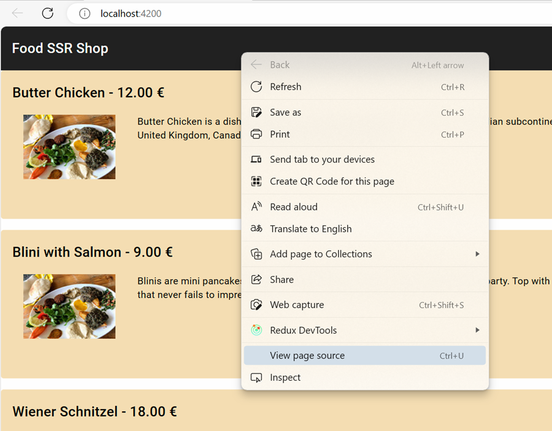
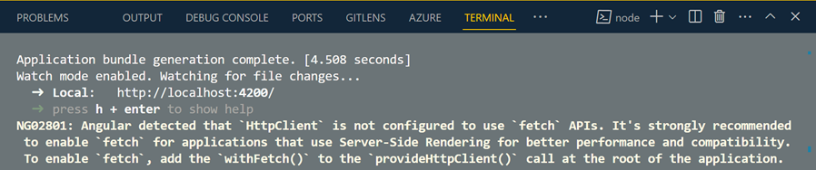

# Hybrid Rendering: SSR, Prerendering and Incremental Hydration

Angular 22 replaces the old "SSR or nothing" switch with **hybrid rendering**: every route picks its own
strategy in `app.routes.server.ts` via `RenderMode.Prerender`, `RenderMode.Server` or `RenderMode.Client`.
The `food-shop-ssr` app in this module prerenders its catalog and its three detail pages at build time,
server-renders everything else, and hydrates the browser incrementally so a card only becomes interactive
once it scrolls into view.

## Demos

The app has two halves. The **shop** at `/` is the SSR subject itself: a prerendered catalog with
server-rendered detail pages. The **demo browser** at `/demos` is the usual course layout, one route per
concept with its guide beside it. Both are the same Angular application.

| #   | Route | Title | Teaches | Topic |
| --- | ----- | ----- | ------- | ----- |
| 1 | `/demos/server-routes` | Server Routes & Render Modes | Declare a RenderMode per route in app.routes.server.ts. Prerender parameterised routes with getPrerenderParams() and cover unknown ids with PrerenderFallback.Server. Needs outputMode: server in angular.json or the file is ignored. | Server Rendering |
| 2 | `/demos/node-app-engine` | Express 5 & AngularNodeAppEngine | Walk the v22 server.ts: express.static for the browser bundle, AngularNodeAppEngine.handle() for everything else, writeResponseToNodeResponse to stream it back, createNodeRequestHandler for serverless hosts. CommonEngine and the Express 4 wildcard are gone. | Server Rendering |
| 3 | `/demos/incremental-hydration` | Incremental Hydration Triggers | Compare @defer (hydrate on interaction), (hydrate on viewport), (hydrate on immediate) and (hydrate never) side by side. Each block reports the moment it hydrated, so the never block is visibly server HTML that never boots. | Hydration |
| 4 | `/demos/transfer-cache` | State Transfer Cache | Stop the client refetching what the server already fetched. httpResource rides the automatic HTTP transfer cache; resource() takes an explicit id that keys it into TransferState. The demo counts the browser network entries for both. | Hydration |
| 5 | `/demos/route-params-signals` | Route Params as Signal Inputs | withComponentInputBinding() delivers :id straight into an input() signal, so a server-rendered component reads its params without ActivatedRoute, toSignal or a subscription. | Routing & Data |
| 6 | `/demos/csr-vs-ssr-delta` | CSR vs SSR Measured Delta | The two render paths measured rather than guessed: prerendered HTML, server-rendered HTML and the client-only shell compared on payload bytes and time to first byte, with the exact commands that produced the numbers. | Measuring & Testing |
| 7 | `/demos/karma-to-vitest` | Karma to Vitest Migration | Replace the Karma builder with @angular/build:unit-test, swap jasmine for vitest globals, and rewrite the specs. Covers the httpResource ordering trap: TestBed.tick() before HttpTestingController.flush(), never whenStable() first. | Measuring & Testing |

The rows above are `db.json` -> `demos`, sorted by `sortOrder`. Each row has a component under
`src/app/demos/samples/<url>/`, a lazy child route in `src/app/demos/demo.routes.ts`, and a guide at
`public/markdown/<md>.md`.

### db.json Carries Both Collections

`db.json` is a json-server seed, not a build input:

```json
{
  "demos": [ /* the seven rows above */ ],
  "food":  [ /* three dishes */ ]
}
```

`npm run api` serves both on `http://localhost:3010`. With the API stopped, `offline-catalog.interceptor.ts`
answers `/food`, `/food/:id` and `/demos` from bundled copies (`food.data.ts`, `demo.data.ts`) so the build,
the prerender and the running app all still work. Any other URL is rethrown unchanged.

## Quick Start

```bash
cd demos/11-ssr/food-shop-ssr
npm install
npm run api      # json-server on http://localhost:3010, serves /demos and /food
npm start        # http://localhost:4200 for the shop, /demos for the demo browser
npm test         # Vitest, 19 specs
```

The API is optional. Without it the app falls back to the bundled catalogs and says so on screen.

## `ng serve` Is Already SSR Here

The most common misconception about this app is that `ng serve` gives you client-side rendering and only
`npm run serve:ssr:food-shop-ssr` gives you SSR. **That is false.** `angular.json` sets `"outputMode": "server"`
and `"ssr": { "entry": "server.ts" }`, so the dev server runs the same server pipeline as production.

Verify it yourself instead of taking the readme's word for it:

```bash
npm start
curl -s http://localhost:4200/ | grep -c "mat-toolbar"
```

The response body already contains the rendered toolbar and `ngh=` hydration annotations. There is no
CSR-versus-SSR comparison to make with `ng serve` in this app.

The same proof without a terminal: open `http://localhost:4200`, right-click, **View page source**. The
markup that comes back already carries the three dishes, not an empty `<app-root>`.



What actually differs between the two commands:

|               | `npm start` (`ng serve`)                                       | `npm run build` + `npm run serve:ssr:food-shop-ssr`             |
| ------------- | -------------------------------------------------------------- | --------------------------------------------------------------- |
| Rendering     | SSR on every request, routes re-rendered on change             | Prerendered HTML for `/` and `/food/1..3`, SSR for the rest     |
| Prerendering  | Skipped, `RenderMode.Prerender` degrades to per-request rendering | Runs at build time, 4 static routes written to disk            |
| Bundles       | Unoptimized, source-mapped, HMR                                | Optimized, hashed, budget-checked                               |
| Server        | Vite dev server                                                | Express 5 (`server.ts`) on port 4000                            |

If you want a genuine CSR baseline to compare against, set the home route to `RenderMode.Client` in
`app.routes.server.ts`, rebuild, and view the source: the `<app-root>` element comes back empty.

## Per-Route Render Modes

`src/app/app.routes.server.ts` is the whole hybrid-rendering configuration:

```typescript
export const serverRoutes: ServerRoute[] = [
  { path: '', renderMode: RenderMode.Prerender },
  {
    path: 'food/:id',
    renderMode: RenderMode.Prerender,
    fallback: PrerenderFallback.Server,
    async getPrerenderParams() {
      const catalog = await inject(FoodService).getCatalog();
      return catalog.map((item) => ({ id: String(item.id) }));
    },
  },
  { path: '**', renderMode: RenderMode.Server },
];
```

It is registered on the server side only:

```typescript
const serverConfig: ApplicationConfig = {
  providers: [provideServerRendering(withRoutes(serverRoutes))],
};
```

`getPrerenderParams()` runs in an injection context, so it can `inject()` application services. It returns one
object per path to generate, keyed by the route parameter name.

`fallback: PrerenderFallback.Server` is what makes `/food/99` work: that id was never prerendered, so the Express
server renders it on demand. The alternatives are `PrerenderFallback.Client` and `PrerenderFallback.None`.

> `RenderMode.Prerender` only produces files when `angular.json` sets `"outputMode": "server"`. Without it the
> builder falls back to the legacy prerender path, ignores `app.routes.server.ts`, and never calls
> `getPrerenderParams()`. The build still succeeds, so the only symptom is a lower route count in the summary.

### routes.txt Is Gone

Earlier versions of this demo shipped a `routes.txt` listing `/food/1`, `/food/2` and `/food/3`. It was never
wired into `angular.json` and had no effect on any build. Parameterized prerendering is `getPrerenderParams()`
now, so the file has been deleted.

## The Node Server

`server.ts` uses `AngularNodeAppEngine` from `@angular/ssr/node` on Express 5:

```typescript
const app = express();
const angularApp = new AngularNodeAppEngine();

app.use(express.static(browserDistFolder, { maxAge: '1y', index: false, redirect: false }));

app.use((req, res, next) => {
  angularApp
    .handle(req)
    .then((response) => (response ? writeResponseToNodeResponse(response, res) : next()))
    .catch(next);
});

export const reqHandler = createNodeRequestHandler(app);
```

`CommonEngine` and the Express 4 `server.get('*', ...)` pattern are retired. Notable differences:

- Express 5 no longer accepts a bare `'*'` path string, which is why the handler is `app.use()` middleware.
- `angularApp.handle()` serves prerendered files, SSR output or the CSR shell depending on the route's `RenderMode`.
- `isMainModule(import.meta.url)` starts the listener only when the file is executed directly, so serverless hosts
  can import `reqHandler` instead.

### SSRF Protection Is On By Default

Angular 22 validates the incoming `Host` header and answers `400 Bad Request` for anything unrecognized:

```
Header "host" with value "localhost:4000" is not allowed.
```

Allow-list your hosts in `angular.json`:

```json
"security": {
  "allowedHosts": ["localhost"]
}
```

`NG_ALLOWED_HOSTS` or `new AngularNodeAppEngine({ allowedHosts: [...] })` do the same job at runtime.

## Incremental Hydration

Incremental hydration is the **default** in Angular 22. `withIncrementalHydration()` is deprecated and
`withNoIncrementalHydration()` now exists only to opt out, which is exactly what this app used to do:

```typescript
provideClientHydration(withEventReplay())
```

With hydration in place, `@defer` blocks gain `hydrate` triggers. The server renders the block's real content (not
its placeholder), ships it as HTML, and defers only the download and hydration of that block's JavaScript:

```html
@for (f of food(); track f.id) {
  @defer (hydrate on viewport) {
    <app-shop-item [food]="f" [inCart]="..." (itemChanged)="updateCart($event)" />
  } @placeholder {
    <div class="skeleton">{{ f.name }}</div>
  }
}
```

Confirm it in the build output: `dist/food-shop-ssr/browser/index.html` contains the fully rendered cards plus a
`__nghDeferData__` block describing which defer blocks are still dehydrated. In DevTools, the
`shop-item-component` chunk is only requested once a card scrolls into view.

`withEventReplay()` pairs with this: clicks that land before a block hydrates are recorded and replayed afterwards.

## Resilient Prerendering

The catalog comes from json-server on port 3010. Prerendering runs at build time, when that API is usually not
running, and the old build produced a home page with zero products in it.

Two guards fix this, and both are worth understanding because they cover different phases:

**1. Build-time route discovery.** `FoodService.getCatalog()` uses a plain guarded `fetch` and returns a bundled
catalog if the API does not answer, so `getPrerenderParams()` always yields three ids:

```typescript
async getCatalog(): Promise<FoodItem[]> {
  try {
    const response = await fetch(`${environment.api}food`);
    return response.ok ? ((await response.json()) as FoodItem[]) : FALLBACK_FOOD;
  } catch {
    return FALLBACK_FOOD;
  }
}
```

**2. Render-time data.** The components keep using `httpResource()`. An interceptor converts a failed catalog
request into a successful response carrying the bundled data plus a marker header:

```typescript
export const offlineCatalogInterceptor: HttpInterceptorFn = (req, next) =>
  next(req).pipe(catchError(() => of(new HttpResponse({ status: 200, body: ..., headers: ... }))));
```

The component reads that header to tell the user which source it is showing:

```typescript
readonly offline = computed(() => this.catalog.headers()?.has(OFFLINE_CATALOG_HEADER) ?? false);
```

Without the interceptor the build still succeeds, but every prerendered page logs a red `ERROR HttpErrorResponse`
and renders an empty list. Run `npm run build` with and without `npm run api` to see both paths.

## Component Patterns

| Concern             | Implementation                                                                   |
| ------------------- | -------------------------------------------------------------------------------- |
| Inputs / outputs    | `input()`, `input.required()`, `output()`                                        |
| Derived input state | `linkedSignal(() => this.inCart())`, not `effect()` writing into a `signal()`     |
| Local state         | `signal()` for the cart, `computed()` for the total                              |
| Data loading        | `httpResource()` for HTTP, `resource({ id })` for TransferState                   |
| Route parameters    | `withComponentInputBinding()` binding `:id` onto an `input()` signal              |
| Change detection    | Zoneless. No explicit `OnPush` anywhere: it is the Angular 22 default            |
| HTTP backend        | `provideHttpClient()` with no `withFetch()` and no `withXhr()`: Fetch is default |
| Control flow        | `@if`, `@for`, `@defer`                                                          |

## Testing

Karma and Jasmine are gone. `angular.json` uses `@angular/build:unit-test`, which runs Vitest in jsdom:

```bash
npm test
```

19 specs across 8 files, all green: the four shop components, the demo container, the hydration probe, the
route-param child and the offline interceptor.

`src/test-setup.ts` is wired through `setupFiles`. The builder initializes the test platform itself, so the setup
file guards on `getPlatform()` before initializing; calling `initTestEnvironment` unconditionally throws
`NG0400: A platform with a different configuration has been created`.

The one non-obvious pattern is ordering around `httpResource()`. The resource issues its request from an effect,
and the app is unstable while that request is in flight, so `await fixture.whenStable()` before flushing deadlocks:

```typescript
fixture.detectChanges();
TestBed.tick();                                   // 1. flush the resource effect, issuing the request

TestBed.inject(HttpTestingController)
  .expectOne((req) => req.url.endsWith('food'))
  .error(new ProgressEvent('error'));             // 2. interceptor substitutes the fallback catalog

await fixture.whenStable();                       // 3. let the resource publish the value
fixture.detectChanges();                          // 4. render it

expect(fixture.componentInstance.offline()).toBe(true);
```

Skipping step 3 is the other half of the trap: the flush resolves a promise, so the value is not on the
signal until the microtask queue drains, and the assertion sees the empty branch.

`TestBed.tick()` replaces the removed `TestBed.flushEffects()`.

## Verifying the Build

```bash
cd demos/11-ssr/food-shop-ssr
npm run build
```

Expect `Prerendered 4 static routes.` and these files:

```
dist/food-shop-ssr/browser/index.html          # prerendered home
dist/food-shop-ssr/browser/food/1/index.html   # prerendered detail
dist/food-shop-ssr/browser/food/2/index.html
dist/food-shop-ssr/browser/food/3/index.html
dist/food-shop-ssr/browser/index.csr.html      # shell for RenderMode.Client routes
dist/food-shop-ssr/server/server.mjs           # Express 5 entry
```

Then serve and probe it:

```bash
npm run serve:ssr:food-shop-ssr

curl -s http://localhost:4000/food/3  | grep -o "Wiener Schnitzel"   # prerendered
curl -s http://localhost:4000/food/99 | grep -o "No dish found"      # SSR fallback
curl -s http://localhost:4000/demos/server-routes | grep -c "ngh="   # SSR, RenderMode.Server
```

Measured on this build, median of seven warm requests with json-server stopped (the full method and the
caveats are in the `csr-vs-ssr-delta` demo):

| Path | Render path | HTML payload | TTFB |
| ---- | ----------- | ------------ | ---- |
| `/index.csr.html` | CSR shell | 68.1 kB | 1.7 ms |
| `/` | prerendered | 89.1 kB | 1.7 ms |
| `/food/2` | prerendered | 105.4 kB | 1.6 ms |
| `/food/99` | server rendered per request | 99.9 kB | 30.7 ms |

## Retired APIs

Everything below was in this module before and no longer belongs in an Angular 22 app:

| Retired                                  | Replacement                                                |
| ---------------------------------------- | ---------------------------------------------------------- |
| `CommonEngine`                           | `AngularNodeAppEngine` from `@angular/ssr/node`             |
| Express 4 `server.get('*', ...)`         | Express 5 `app.use()` middleware                            |
| `routes.txt` / `prerender.routesFile`    | `RenderMode.Prerender` + `getPrerenderParams()`             |
| `withNoIncrementalHydration()`           | Nothing: incremental hydration is the default               |
| `withIncrementalHydration()`             | Deprecated in 22, incremental hydration is the default      |
| `withFetch()`                            | Deprecated: `FetchBackend` is already the default backend   |
| `provideAnimations()`                    | Deprecated in 20.2: use `animate.enter` / `animate.leave`   |
| Karma + Jasmine                          | `@angular/build:unit-test` on Vitest                        |
| `TestBed.flushEffects()`                 | `TestBed.tick()`                                            |
| Explicit `ChangeDetectionStrategy.OnPush`| The Angular 22 default                                      |

`withFetch()` is the one students still reach for, because older Angular versions greeted every SSR dev
server with this:



Angular 22 no longer prints it. `FetchBackend` is the default, so `provideHttpClient()` on its own is
already what NG02801 was asking for, and adding `withFetch()` back is a deprecation warning rather than a
fix.

## Related Topics

- [Angular Hybrid Rendering](https://angular.dev/guide/hybrid-rendering)
- [Server Route Configuration](https://angular.dev/guide/hybrid-rendering#server-route-configuration)
- [Incremental Hydration](https://angular.dev/guide/incremental-hydration)
- [Preventing SSRF](https://angular.dev/best-practices/security#preventing-server-side-request-forgery-ssrf)
- [ngOptimizedImage](https://angular.dev/guide/image-optimization)
