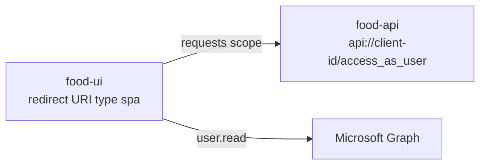

# Microsoft Entra ID with MSAL Angular

MSAL Angular (`@azure/msal-angular` 6, on top of `@azure/msal-browser` 5) runs the authorization
code flow with PKCE against Microsoft Entra ID. It ships the three pieces you built by hand in this
module: a token cache, a guard and an interceptor.

## Register two apps

The API and the SPA are separate registrations. The API exposes a scope; the SPA asks for it.



```bash
az ad app create --display-name food-api --sign-in-audience AzureADMyOrg
az ad app update --id <api-client-id> --identifier-uris api://<api-client-id>
# Expose an API: add the delegated scope access_as_user

az ad app create --display-name food-ui --sign-in-audience AzureADMyOrg
az rest --method PATCH \
  --uri https://graph.microsoft.com/v1.0/applications/<ui-object-id> \
  --headers Content-Type=application/json \
  --body '{"spa":{"redirectUris":["http://localhost:4200/"]}}'
# API permissions: add food-api / access_as_user and grant admin consent
```

The redirect URI must be of type `spa`. Registered as `web`, the token request fails with a CORS
error, because only `spa` redirect URIs allow cross-origin redemption without a secret.

## Provide MSAL in a standalone app

`MsalModule.forRoot()` and `MsalRedirectComponent` belong to the module world. A standalone app
provides the tokens directly and handles the redirect response in an app initializer:

```typescript
export function provideMsal(): (Provider | EnvironmentProviders)[] {
  return [
    {
      provide: MSAL_INSTANCE,
      useFactory: () =>
        new PublicClientApplication({
          auth: {
            clientId: environment.entra.clientId,
            authority: environment.entra.authority,
            redirectUri: environment.entra.redirectUri,
            postLogoutRedirectUri: environment.entra.redirectUri
          },
          cache: { cacheLocation: BrowserCacheLocation.LocalStorage }
        })
    },
    {
      provide: MSAL_GUARD_CONFIG,
      useValue: {
        interactionType: InteractionType.Redirect,
        authRequest: { scopes: environment.entra.apiScopes }
      } satisfies MsalGuardConfiguration
    },
    {
      provide: MSAL_INTERCEPTOR_CONFIG,
      useValue: {
        interactionType: InteractionType.Redirect,
        protectedResourceMap: new Map([
          ['https://graph.microsoft.com/v1.0/me', ['user.read']],
          [`${environment.api}*`, environment.entra.apiScopes]
        ])
      } satisfies MsalInterceptorConfiguration
    },
    { provide: HTTP_INTERCEPTORS, useClass: MsalInterceptor, multi: true },
    MsalService,
    MsalGuard,
    MsalBroadcastService,
    provideAppInitializer(() =>
      firstValueFrom(inject(MsalService).handleRedirectObservable(), { defaultValue: null })
    )
  ];
}
```

Three details carry weight:

- `MsalInterceptor` is a class-based interceptor, so `app.config.ts` needs
  `provideHttpClient(withInterceptorsFromDi())`.
- The initializer processes `?code=...` before the router runs; without it the router can navigate
  away from the redirect URL before MSAL reads the code.
- Guard and interceptor use the same `InteractionType`, so a missing token always leads to the
  same full-page redirect.

## Protect routes and read the user

```typescript
{
  path: 'food',
  canActivate: [MsalGuard],
  loadChildren: () => import('./food/food.routes').then((m) => m.foodRoutes)
}
```

`MsalGuard` is still class-based and runs as `canActivate`; if the user has no session it starts
`loginRedirect`. Read the account into signals, gated on `InteractionStatus.None`. MSAL 6 leaves
change detection to the consumer, which signals satisfy:

```typescript
private readonly status = toSignal(this.broadcast.inProgress$, {
  initialValue: InteractionStatus.Startup
});

readonly account = computed(() =>
  this.status() === InteractionStatus.None ? this.msal.instance.getAllAccounts()[0] ?? null : null
);
```

## Validate the token in the API

```csharp
builder.Services
    .AddAuthentication(JwtBearerDefaults.AuthenticationScheme)
    .AddMicrosoftIdentityWebApi(builder.Configuration.GetSection("AzureAd"));
```

`AzureAd` holds `Instance`, `TenantId`, `ClientId` and `Audience` of the API registration, never of
the SPA. A global `AuthorizeFilter` with `RequireAuthenticatedUser()` protects every controller
without an attribute on each.

## Run the demo

1. Open **Microsoft Entra ID with MSAL Angular** and step through the snippet tabs in order: app
   registrations, environment, providers, config, routes, user, API.
2. In **Which token does MsalInterceptor attach?**, try `https://localhost:5001/api/food/7`,
   `https://graph.microsoft.com/v1.0/me` and `https://cdn.example.com/app.js`.

Expected result: the first gets the API scope, the second `user.read`, the third no token at all.

## Links

- [MSAL Angular](https://github.com/AzureAD/microsoft-authentication-library-for-js/tree/dev/lib/msal-angular)
- [Angular standalone sample](https://github.com/AzureAD/microsoft-authentication-library-for-js/tree/dev/samples/msal-angular-samples/angular-standalone-sample)
- [Protected web API: app registration](https://learn.microsoft.com/en-us/entra/identity-platform/scenario-protected-web-api-app-registration)
