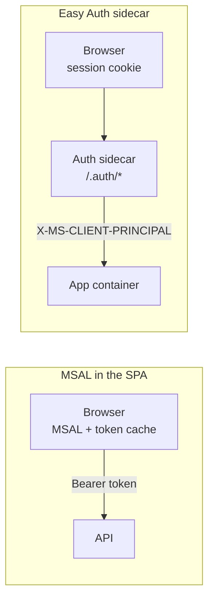

# MSAL vs Easy Auth

Everything so far put the OAuth client in the browser. Azure App Service and Azure Container Apps
offer the opposite: built-in authentication, known as Easy Auth, runs as a sidecar container next
to yours, performs the flow, and hands your app the identity as request headers.

## Where the flow runs



| | MSAL in the SPA | Easy Auth sidecar |
| --- | --- | --- |
| Runs the flow | The browser | The platform |
| Browser holds | Access token | Session cookie |
| Sign in | `loginRedirect()` | Link to `/.auth/login/aad` |
| Who am I | `getAllAccounts()` | `GET /.auth/me` |
| API receives | `Authorization: Bearer` | `X-MS-CLIENT-PRINCIPAL` headers |
| Runs on localhost | Yes | No |

## Use it from Angular

With Easy Auth the SPA has no OAuth code at all. Sign-in and sign-out are links, and the current
user is one `httpResource()`:

```html
<a href="/.auth/login/aad?post_login_redirect_uri=/orders">Sign in</a>
<a href="/.auth/logout?post_logout_redirect_uri=/">Sign out</a>
```

```typescript
@Service()
export class EasyAuthService {
  private readonly me = httpResource<AuthMe[]>(() => '/.auth/me');

  readonly user = computed(() => (this.me.hasValue() ? this.me.value()[0] ?? null : null));
  readonly isAuthenticated = computed(() => this.user() !== null);
}
```

The links must be plain `href`, not `routerLink`. The Angular router would otherwise swallow
`/.auth/login/aad` and the sidecar never sees the request. `/.auth/me` needs the token store enabled,
which on Container Apps means a blob storage container.

## Read the identity in the API

The sidecar strips any incoming `X-MS-CLIENT-PRINCIPAL*` header and sets its own, so the app can
trust it. `X-MS-CLIENT-PRINCIPAL` is base64 JSON with `auth_typ`, `name_typ`, `role_typ` and a
`claims` array of `{ typ, val }`. `X-MS-CLIENT-PRINCIPAL-NAME` and `-ID` carry the common values
directly.

## Enable it on a container app

```bash
az containerapp auth microsoft update \
  --name food-shop --resource-group rg-food \
  --client-id <app-id> --client-secret <secret> \
  --tenant-id <tenant-id> --yes

az containerapp auth update \
  --name food-shop --resource-group rg-food \
  --unauthenticated-client-action AllowAnonymous \
  --token-store true --sas-url-secret-name token-store-sas
```

The app registration is a `web` app with the redirect URI
`https://<app>.<environment>.<region>.azurecontainerapps.io/.auth/login/aad/callback` and ID token
issuance enabled. `AllowAnonymous` lets the SPA load before sign-in; `RedirectToLoginPage` would
put every asset, including `index.html`, behind the login.

## Choose

Use MSAL when the SPA calls several APIs, Microsoft Graph, or anything not hosted next to it, or
when it must run on a laptop. Use Easy Auth when the SPA and its API ship together on App Service
or Container Apps and you want no token in the browser.

## Run the demo

1. Open **MSAL vs Easy Auth** and read the comparison table.
2. In **Decode X-MS-CLIENT-PRINCIPAL**, the sample header decodes to Ada Lovelace with the role
   `Orders.Read`.
3. Replace a character in the header. The status turns into the decode error.

Expected result: name and roles are read through `name_typ` and `role_typ`, not through fixed claim
names.

## Links

- [Authentication and authorization in Azure Container Apps](https://learn.microsoft.com/en-us/azure/container-apps/authentication)
- [Work with user identities in App Service authentication](https://learn.microsoft.com/en-us/azure/app-service/configure-authentication-user-identities)
