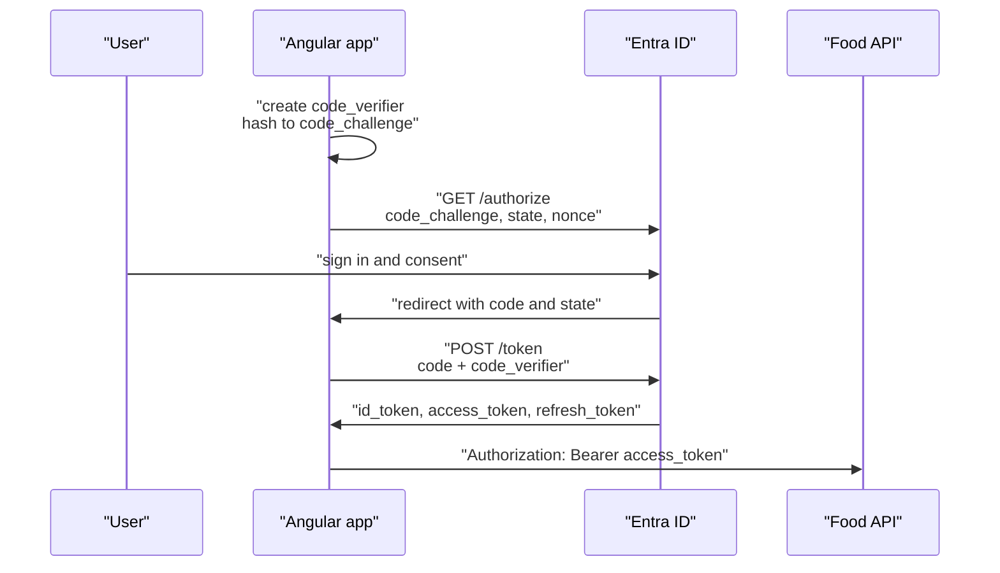

# OAuth 2.0 and OpenID Connect

OAuth 2.0 answers "may this app call that API on the user's behalf" and hands out an access token.
OpenID Connect sits on top and answers "who is the user" with an ID token. An Angular app needs
both: the ID token to show who is signed in, the access token to call the API.

## The parties

| Role | In this module |
| --- | --- |
| Resource owner | The user |
| Client | The Angular app, a public client with no secret |
| Authorization server | Microsoft Entra ID, Firebase, any OIDC provider |
| Resource server | Your ASP.NET Core API |

## The three tokens

| Token | Audience | Used for |
| --- | --- | --- |
| ID token | The client | Reading the signed-in user's name and id |
| Access token | The API | `Authorization: Bearer` on every API call |
| Refresh token | The authorization server | Getting a new access token without a prompt |

Never send the ID token to your API as a bearer token. Its `aud` claim names the client, so an API
that accepts it is accepting tokens minted for somebody else.

## Authorization code flow with PKCE

The implicit flow, which returned tokens in the URL fragment, is gone from current guidance. A
single-page app uses the authorization code flow with PKCE, and Microsoft Entra ID requires PKCE
for redirect URIs of type `spa`.

## Run the demo

1. Open **OAuth 2.0 and OpenID Connect**. The page generates a 32 byte `code_verifier` with
   `crypto.getRandomValues()` and its `S256` challenge with `crypto.subtle.digest()`.
2. Change the tenant to your tenant id and the client id to your SPA registration. The
   `/authorize` URL updates as you type.
3. Click **Generate a new PKCE pair** and compare: only `code_challenge` appears in the redirect,
   `code_verifier` appears only in the `POST /token` body.

Expected result: two requests you could paste into a REST client, with no `client_secret` in
either.

## What each parameter defends against

| Parameter | Attack it stops |
| --- | --- |
| `code_challenge` / `code_verifier` | A stolen authorization code is useless without the verifier |
| `state` | Cross-site request forgery on the redirect |
| `nonce` | Replay of an old ID token |
| `redirect_uri` (exact match) | Codes delivered to an attacker's page |

## Refresh in the browser

Entra ID issues SPA refresh tokens with a fixed 24 hour lifetime, and refreshing does not extend it.
After a day the library runs the code flow again in a top-level redirect; the user sees a reload,
not a password prompt. Libraries such as MSAL handle this; hand-written clients usually do not.

## Links

- [Microsoft identity platform and the OAuth 2.0 authorization code flow](https://learn.microsoft.com/en-us/entra/identity-platform/v2-oauth2-auth-code-flow)
- [RFC 7636: Proof Key for Code Exchange](https://datatracker.ietf.org/doc/html/rfc7636)
- [OpenID Connect Core 1.0](https://openid.net/specs/openid-connect-core-1_0.html)
